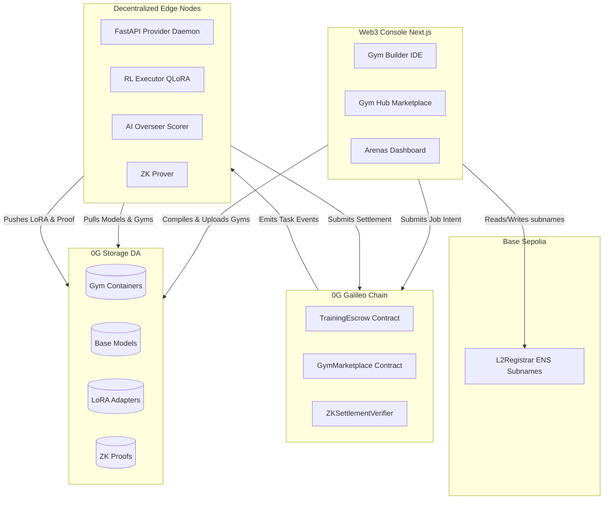
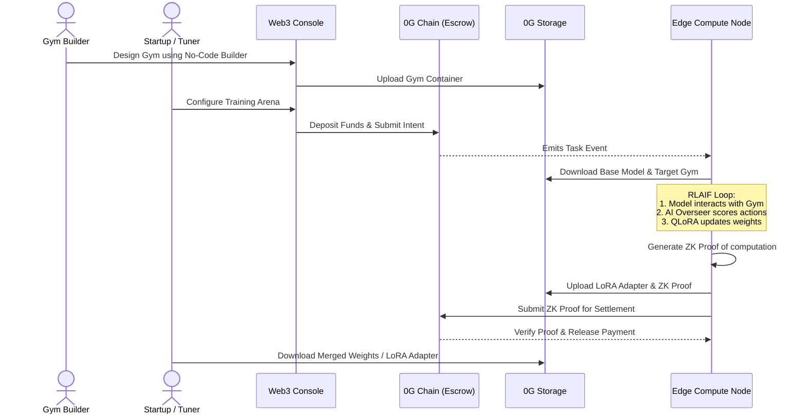
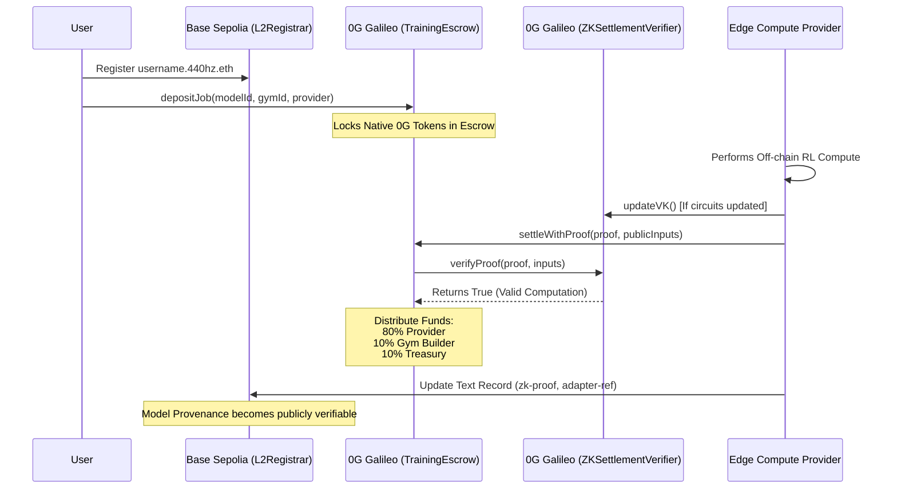

# 440hz - Federated Training Gyms for Frontier LLMs

440hz is the first decentralized, federated **RLAIF (Reinforcement Learning from AI Feedback)** platform built natively on the **0G ecosystem**. It connects model tuners, domain-expert environment designers, and decentralized hardware providers to enable high-fidelity LLM tuning on edge compute with Zero-Knowledge verified integrity.

## Summary

To build highly capable, agentic AI, foundation models must move beyond static text prediction and practice in interactive environments. 440hz provides custom-built sandboxes ("Training Gyms") where LLMs can practice multi-step workflows or domain-specific applications through trial and error—without breaking production environments or leaking sensitive IP.

---

## The Problem

### 1. The Data Privacy Silo
The most valuable training data in the world is locked behind corporate firewalls. Enterprises cannot upload highly sensitive data to centralized LLM providers, and competitors cannot share data pools.

### 2. The Cloud Bandwidth Bottleneck
Uploading terabytes of high-frequency edge data to AWS/GCP incurs massive ingress/egress fees and introduces unacceptable latency. Moving the data to the model is no longer sustainable.

### 3. The Knowledge Bottleneck
AI labs are hitting the "data wall"—the limit of high-quality, human-generated text available for training. To scale further, models need to learn from the consequences of their actions in interactive environments.

---

## The Solution

440hz solves these bottlenecks by decentralizing the simulation environments and federating the compute:

- **No-Code Gym UI**: A drag-and-drop builder for experts to create complex Gymnasium training environments without writing Python.
- **Federated "Edge" Compute**: Using **Parameter-Efficient Fine-Tuning (QLoRA)**, base models are pushed down to the data. Models train locally on edge hardware or within **0G TEEs**, bypassing cloud egress fees entirely.
- **AI-Overseer Verification (RLAIF)**: Small, fast models (like Mistral Small or MiMo-v2-flash) act as the reward function, automating the RL loop and removing the human bottleneck in training.

---

## Technical Architecture

440hz uses a modular, dual-chain architecture integrating the **0G ecosystem** for storage and computation orchestration, alongside **Base Sepolia** for its foundational identity layer.

### 1. System Overview


### 2. End-to-End User Flow


### 3. On-Chain Flow & Settlement


---

## Core Concepts

### Training Gyms: The Bridge from "Knowing" to "Doing"
Base models are primarily trained via Supervised Learning (mimicking human text). To reach the next level of intelligence, models need **Reinforcement Learning**, where they learn from the consequences of their actions inside a closed environment with access to problems, datasets, documentation, and software infrastructure.

### Zero-Knowledge Settlement
To ensure trustless training, providers submit **ZK verified proofs** upon completion. The `ZKSettlementVerifier` on the 0G Chain guarantees computational integrity, removing the need for traditional Trusted Execution Environments (TEEs) while still supporting them for data privacy.

### ENS as a Decentralized Database
We heavily utilize ENS text records to store verifiable metadata. After a model is trained, the ZK proof reference and the 0G Storage root hash of the LoRA adapter are written directly into the ENS text records of the model's subname (`zk-proof = <hash>`, `adapter-ref = <hash>`).

---

## User Journey

1.  **Design & Register**: A developer builds a Gym in the 440hz UI. The compiled container is pushed to 0G Storage.
2.  **Intent Matching**: A startup submits a training intent on the 0G Chain, locking tokens in escrow, selecting a base model, and choosing the target Gym.
3.  **Data Routing**: 0G DA streams the base model and Gym container to the matched 0G Compute node.
4.  **The RLAIF Loop**: The LLM interacts with the Gym. The AI Overseer scores the actions. Raw data (mounted locally) never leaves the container.
5.  **Adapter Upload**: Training concludes. The new LoRA adapter and a ZK proof of computation are uploaded to 0G Storage.
6.  **Federated Aggregation**: If multiple nodes were used, **Flower.ai** pulls the LoRA weights and mathematically averages them (FedAvg) into a global update.
7.  **Settlement**: The 0G Chain verifies the ZK proof, pays the providers, and 440hz allows the user to download the final weights.

---

## Tech Stack

- **Frontend**: Next.js 16 (React 19, Tailwind v4, TypeScript), `@xyflow/react` for node editing.
- **Backend/Executor**: Python 3.11+, Docker (DinD), PEFT (QLoRA), Transformers, Flower (flwr).
- **Blockchain**: 0G Galileo Testnet, Base Sepolia (Identity).
- **Storage**: 0G Storage DA.
- **ZK Prover**: Custom Rust-based prover for settlement verification.

---

## Getting Started

### 1. Web Frontend
```bash
cd web
npm install
npm run dev
```

### 2. Smart Contracts
```bash
cd contracts
npm install
npx hardhat test
```

### 3. ZK Settlement Server
```bash
cd 0g-zk-settlement-server
yarn install
yarn compile
yarn start
```

### 4. Core Executor (Docker)
```bash
cd core
./scripts/build-images.sh
./scripts/federated-demo.sh
```

---

## License
This project is licensed under the MIT License - see the [LICENSE](LICENSE) file for details.

---
*Built for ETHGlobal 2026 - Leveraging the power of 0G ecosystem.*
